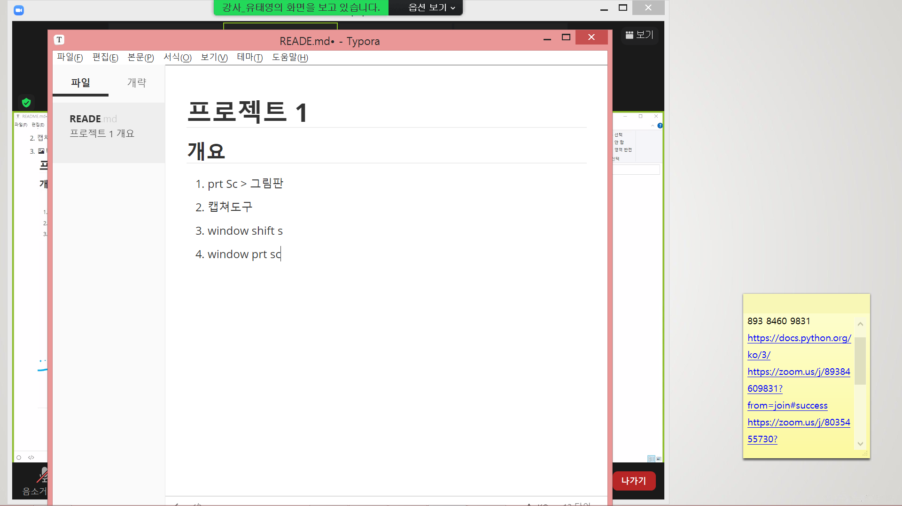

# 깃허브 특강2

nano emacs vum

#### command mode

1. esc
2. `:w` : 저장
3. `:q` : 종료
4.  `:wq` : 저장 후 종료
5.  :`q!` : 강제 종료

#### 캡쳐하는 법

1. prt Sc > 그림판
2. 캡쳐도구
3. window shift s  윈도우 10
4. window prt sc  윈도우 8
5. 

#### 참고

https://backlog.com/git-tutorial/kr/
